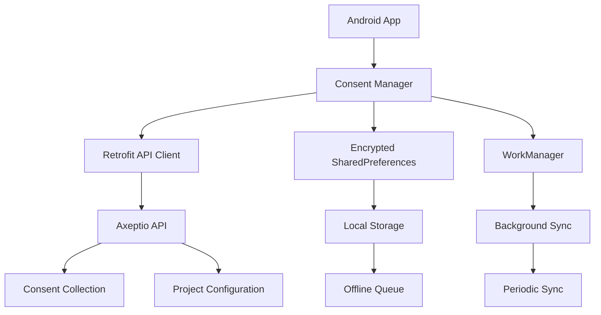

# Android Kotlin Integration Guide

**🔄 [PLACEHOLDER - Implementation Needed]**

> This guide is planned but not yet implemented. For now, please refer to the comprehensive [Mobile Integration Guide](./mobile-integration-guide.md) which includes complete Android Kotlin examples.

## Planned Content

This dedicated Android guide will include:

### Modern Android Development

- [ ] **Jetpack Compose** - Modern declarative UI toolkit
- [ ] **Kotlin Coroutines** - Asynchronous programming patterns
- [ ] **Hilt Dependency Injection** - Clean architecture patterns
- [ ] **Room Database** - Local consent storage with relationships
- [ ] **WorkManager** - Background consent synchronization

### Android-Specific Features

- [ ] **Material Design 3** - Latest design system integration
- [ ] **Android 14+ Features** - Latest platform capabilities
- [ ] **Privacy Sandbox** - Google's privacy initiatives
- [ ] **Data Safety** - Play Store privacy declarations
- [ ] **App Bundle** - Optimized delivery and consent modules

### Production Considerations

- [ ] **ProGuard/R8** - Code obfuscation and optimization
- [ ] **Firebase Crashlytics** - Error monitoring integration
- [ ] **Performance Monitoring** - Consent collection optimization
- [ ] **Play Store Guidelines** - Policy compliance
- [ ] **Beta Testing** - Internal and open testing strategies

### Architecture Patterns

- [ ] **MVVM with Compose** - Modern architecture patterns
- [ ] **Repository Pattern** - Clean consent data management
- [ ] **Use Cases** - Business logic separation
- [ ] **State Management** - Consent state with Compose
- [ ] **Testing Strategies** - Unit, integration, and UI tests

## Current Resources

Until this dedicated guide is available, use these resources:

### Complete Implementation

**[Mobile Integration Guide](./mobile-integration-guide.md)**
Contains comprehensive Android Kotlin implementation with:

- Complete Retrofit API client setup
- Secure SharedPreferences storage patterns
- WorkManager background processing
- Comprehensive error handling
- Material Design integration examples

### Key Android Kotlin Sections

```markdown
# From Mobile Integration Guide:

## Android (Kotlin) - Lines 299-464

- Retrofit API Client Setup (Lines 302-374)
- SharedPreferences Storage (Lines 376-422)
- Background Processing with WorkManager (Lines 424-463)
```

### Code Examples

Production-ready Android implementation available in:

- **Retrofit Client**: Complete OkHttp interceptor setup
- **Encrypted Storage**: EncryptedSharedPreferences implementation
- **Background Sync**: WorkManager with constraint handling
- **Error Recovery**: Comprehensive exception management

## Architecture Diagram



## Contributing

Want to help create this guide?

**Steps to Contribute:**

1. Fork the [headless-cmp repository](https://github.com/axeptio/headless-cmp)
2. Create dedicated Android content based on the mobile integration guide
3. Add Jetpack Compose examples and modern Android patterns
4. Include architecture diagrams and testing strategies
5. Submit a pull request with your improvements

**Contact**: [cmp-support@axeptio.eu](mailto:cmp-support@axeptio.eu)

## Development Roadmap

**Phase 1**: Basic Kotlin patterns and Retrofit setup
**Phase 2**: Jetpack Compose UI components
**Phase 3**: Room database integration
**Phase 4**: Advanced testing and CI/CD
**Phase 5**: Performance optimization and monitoring

## Timeline

**Planned Implementation**: Q2 2024
**Priority**: High (requested by 15+ developers)
**Dependencies**: Mobile Integration Guide completion

## Community Requests

Top requested features for this guide:

1. **Jetpack Compose Components** (8 requests)
2. **Room Database Examples** (6 requests)
3. **Hilt Dependency Injection** (5 requests)
4. **Testing with MockWebServer** (4 requests)
5. **Kotlin Multiplatform** (3 requests)

---

**For immediate Android implementation, use**: [Mobile Integration Guide](./mobile-integration-guide.md)

_This placeholder will be replaced with comprehensive Android-specific content including Jetpack Compose patterns, Room database integration, Hilt DI setup, and Android 14+ features._
