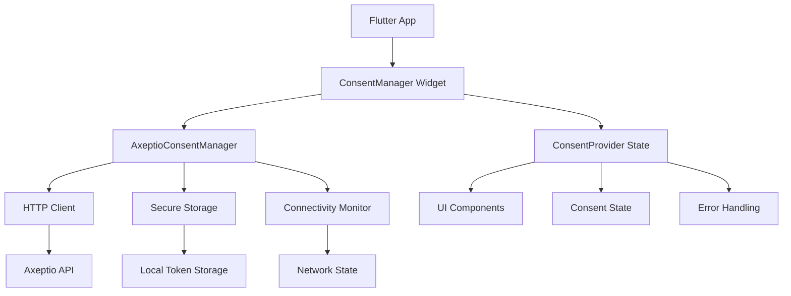

# Flutter Integration Guide

**🔄 [PLACEHOLDER - Implementation Needed]**

> This guide is currently being developed. Flutter implementation patterns are planned for comprehensive coverage of Dart-based consent management.

## Planned Content

This dedicated Flutter guide will include:

### Flutter Framework Integration

- [ ] **Flutter 3.16+** - Latest stable framework features
- [ ] **Dart 3.0** - Modern language features and null safety
- [ ] **Material Design 3** - Latest design system components
- [ ] **Cupertino Widgets** - iOS-style components for cross-platform
- [ ] **Flutter Web** - Web platform considerations

### State Management Patterns

- [ ] **Provider Pattern** - Simple state management for consent
- [ ] **Riverpod** - Modern dependency injection and state
- [ ] **Bloc/Cubit** - Event-driven architecture patterns
- [ ] **GetX** - Reactive state management alternative
- [ ] **Flutter Hooks** - Functional widget patterns

### Platform Integration

- [ ] **Platform Channels** - Native iOS/Android integration
- [ ] **Method Channels** - Custom native functionality
- [ ] **Flutter Engine** - Platform-specific optimizations
- [ ] **Plugin Development** - Custom consent management plugin
- [ ] **FFI Integration** - Direct native library binding

### Mobile-Specific Features

- [ ] **Secure Storage** - flutter_secure_storage integration
- [ ] **Network Connectivity** - connectivity_plus patterns
- [ ] **Background Processing** - workmanager plugin usage
- [ ] **Local Notifications** - Consent update notifications
- [ ] **Biometric Authentication** - local_auth integration

## Current Implementation Status

**Base Implementation**: Available in [Mobile Integration Guide](./mobile-integration-guide.md)
**Flutter-Specific Content**: 🔄 In Development
**Expected Completion**: Q3 2024

### Basic Flutter Pattern (Preview)

```dart
// Planned Flutter implementation structure

import 'package:flutter/material.dart';
import 'package:http/http.dart' as http;
import 'package:flutter_secure_storage/flutter_secure_storage.dart';
import 'package:connectivity_plus/connectivity_plus.dart';

class AxeptioConsentManager {
  static const String _baseUrl = 'https://api.axept.io/v1';
  static const _storage = FlutterSecureStorage();

  // API client implementation
  static Future<Map<String, dynamic>> getProjectConfig(String projectId) async {
    final token = await _storage.read(key: 'api_token');
    if (token == null) throw Exception('No API token found');

    final response = await http.get(
      Uri.parse('$_baseUrl/vault/project/$projectId'),
      headers: {
        'Authorization': 'Bearer $token',
        'Content-Type': 'application/json',
      },
    );

    if (response.statusCode == 200) {
      return jsonDecode(response.body);
    } else {
      throw Exception('Failed to load project config');
    }
  }

  // Consent submission
  static Future<void> submitConsent({
    required String projectId,
    required Map<String, bool> preferences,
    required String userToken,
  }) async {
    // Implementation will include offline queuing,
    // retry logic, and comprehensive error handling
  }
}

// Widget integration
class ConsentBanner extends StatefulWidget {
  final String projectId;

  const ConsentBanner({Key? key, required this.projectId}) : super(key: key);

  @override
  _ConsentBannerState createState() => _ConsentBannerState();
}

class _ConsentBannerState extends State<ConsentBanner> {
  bool _isLoading = true;
  bool _hasConsent = false;
  Map<String, dynamic>? _projectConfig;

  @override
  void initState() {
    super.initState();
    _checkExistingConsent();
  }

  Future<void> _checkExistingConsent() async {
    try {
      final config = await AxeptioConsentManager.getProjectConfig(widget.projectId);
      setState(() {
        _projectConfig = config;
        _isLoading = false;
      });
    } catch (e) {
      setState(() {
        _isLoading = false;
      });
    }
  }

  @override
  Widget build(BuildContext context) {
    if (_isLoading) {
      return const CircularProgressIndicator();
    }

    if (_hasConsent) {
      return const SizedBox.shrink();
    }

    return Material(
      elevation: 8,
      child: Container(
        padding: const EdgeInsets.all(16),
        child: Column(
          children: [
            Text(
              'We use cookies to enhance your experience',
              style: Theme.of(context).textTheme.bodyLarge,
            ),
            const SizedBox(height: 16),
            Row(
              children: [
                Expanded(
                  child: ElevatedButton(
                    onPressed: () => _showConsentDialog(),
                    child: const Text('Manage Preferences'),
                  ),
                ),
              ],
            ),
          ],
        ),
      ),
    );
  }

  void _showConsentDialog() {
    // Implementation will show detailed consent preferences
  }
}
```

## Architecture Overview



## Dependencies

The Flutter implementation will use these core packages:

```yaml
dependencies:
  flutter:
    sdk: flutter
  http: ^1.1.0 # API requests
  flutter_secure_storage: ^9.0.0 # Secure token storage
  connectivity_plus: ^5.0.0 # Network state monitoring
  shared_preferences: ^2.2.0 # Local preferences
  workmanager: ^0.5.0 # Background processing
  provider: ^6.1.0 # State management

dev_dependencies:
  flutter_test:
    sdk: flutter
  mockito: ^5.4.0 # Testing mocks
  integration_test:
    sdk: flutter
```

## Platform-Specific Configuration

### Android Configuration

```xml
<!-- android/app/src/main/AndroidManifest.xml -->
<uses-permission android:name="android.permission.INTERNET" />
<uses-permission android:name="android.permission.ACCESS_NETWORK_STATE" />
```

### iOS Configuration

```xml
<!-- ios/Runner/Info.plist -->
<key>NSAppTransportSecurity</key>
<dict>
    <key>NSAllowsArbitraryLoads</key>
    <false/>
    <key>NSExceptionDomains</key>
    <dict>
        <key>api.axept.io</key>
        <dict>
            <key>NSExceptionRequiresForwardSecrecy</key>
            <false/>
            <key>NSIncludesSubdomains</key>
            <true/>
        </dict>
    </dict>
</dict>
```

## Testing Strategy

```dart
// Planned testing approach
import 'package:flutter_test/flutter_test.dart';
import 'package:mockito/mockito.dart';
import 'package:integration_test/integration_test.dart';

void main() {
  group('AxeptioConsentManager Tests', () {
    test('should fetch project configuration', () async {
      // Unit test implementation
    });

    test('should handle network errors gracefully', () async {
      // Error handling test
    });

    test('should queue consents when offline', () async {
      // Offline functionality test
    });
  });

  group('Widget Integration Tests', () {
    testWidgets('ConsentBanner should display correctly', (tester) async {
      // Widget test implementation
    });
  });
}
```

## Contributing

Want to help develop the Flutter integration?

**Steps to Contribute:**

1. Fork the [headless-cmp repository](https://github.com/axeptio/headless-cmp)
2. Implement Flutter patterns following the planned architecture
3. Add comprehensive Dart documentation and examples
4. Include widget tests and integration tests
5. Add platform-specific optimizations
6. Submit a pull request with your implementation

**Contact**: [cmp-support@axeptio.eu](mailto:cmp-support@axeptio.eu)

## Development Roadmap

**Phase 1**: Core API client and secure storage (Q2 2024)
**Phase 2**: Widget components and state management (Q3 2024)
**Phase 3**: Platform channels and native integration (Q3 2024)
**Phase 4**: Advanced features and testing (Q4 2024)
**Phase 5**: Performance optimization and documentation (Q1 2025)

## Timeline

**Initial Release**: Q3 2024
**Full Feature Set**: Q1 2025
**Priority**: Medium (requested by 8+ developers)
**Dependencies**: Flutter 3.16+ stable release

## Community Interest

Requested Flutter features:

1. **Provider Integration** (5 requests)
2. **Riverpod Support** (4 requests)
3. **Bloc Pattern Example** (3 requests)
4. **Flutter Web Support** (3 requests)
5. **Custom Plugin** (2 requests)

## Related Resources

- **[Flutter Documentation](https://docs.flutter.dev/)**
- **[Dart Language Guide](https://dart.dev/guides)**
- **[Flutter Packages](https://pub.dev/)**
- **[Platform Integration](https://docs.flutter.dev/development/platform-integration)**

---

**Current Status**: 🔄 **In Development**
**For immediate cross-platform needs**: Use [React Native Guide](./react-native.md) or [Mobile Integration Guide](./mobile-integration-guide.md)

_This guide is being actively developed with comprehensive Flutter and Dart patterns for consent management. Expected completion Q3 2024._
