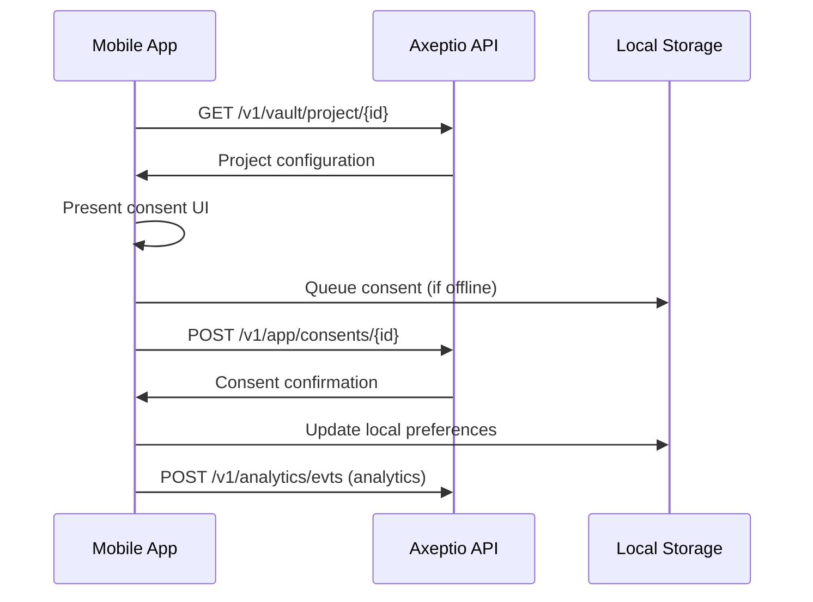

# Mobile App Consent Management Integration Guide

A comprehensive guide for implementing Axeptio consent management in native mobile applications.

## Table of Contents

- [Getting Started](#getting-started)
- [Core API Integration](#core-api-integration)
- [Implementation Patterns](#implementation-patterns)
- [Platform-Specific Implementation](#platform-specific-implementation)
- [Advanced Features](#advanced-features)
- [Testing & Deployment](#testing--deployment)

## Getting Started

### Prerequisites

- **API Access**: Axeptio project credentials (Project ID, API token)
- **Development Environment**: iOS (Xcode 12+), Android (Android Studio), React Native, or Flutter
- **Network Permissions**: Internet access for API communication
- **Storage Permissions**: Local storage for offline consent management

### Authentication Setup

All API requests require Bearer token authentication:

```http
Authorization: Bearer YOUR_ACCESS_TOKEN
```

**Token Management Best Practices:**

- Store tokens securely (Keychain on iOS, EncryptedSharedPreferences on Android)
- Implement token refresh mechanisms
- Handle token expiration gracefully

## Core API Integration

### Essential Endpoints

#### 1. Project Configuration

```http
GET /v1/vault/project/{projectId}
```

Retrieve project configuration including consent categories, vendors, and UI settings.

**Response Structure:**

```json
{
  "id": "project_id",
  "name": "My Mobile App",
  "cookies": [{
    "steps": [...],
    "vendors": [...],
    "language": "en",
    "uiSettings": {...}
  }],
  "configuration": {
    "websiteURL": "https://myapp.com",
    "privacyPolicyURL": "https://myapp.com/privacy"
  }
}
```

#### 2. Consent Collection

```http
POST /v1/app/consents/{clientId}/cookies/{configId}
```

Submit user consent preferences in real-time.

**Request Body:**

```json
{
  "accept": true,
  "preferences": {
    "vendors": {
      "google_analytics": true,
      "facebook_pixel": false,
      "hotjar": true
    },
    "googleConsentMode": {
      "version": 2,
      "ad_storage": "denied",
      "analytics_storage": "granted",
      "ad_user_data": "denied",
      "ad_personalization": "denied"
    }
  },
  "token": "user_unique_identifier"
}
```

#### 3. Consent Retrieval

```http
GET /v1/app/consent/{clientId}?token={token}&service=cookies
```

Retrieve existing user consent for preference restoration.

#### 4. Analytics Events

```http
POST /v1/analytics/evts
```

Submit user interaction analytics for compliance reporting.

## Implementation Patterns

### Consent Collection Flow



### Core Data Models

#### Consent Request

```typescript
interface ConsentRequest {
  accept: boolean;
  preferences: {
    vendors: Record<string, boolean>;
    googleConsentMode?: GoogleConsentMode;
  };
  token: string;
  metadata?: {
    userAgent: string;
    language: string;
    country?: string;
    timestamp: string;
  };
}
```

#### Google Consent Mode v2

```typescript
interface GoogleConsentMode {
  version: 2;
  ad_storage: "granted" | "denied";
  analytics_storage: "granted" | "denied";
  ad_user_data: "granted" | "denied";
  ad_personalization: "granted" | "denied";
  functionality_storage?: "granted" | "denied";
  personalization_storage?: "granted" | "denied";
  security_storage?: "granted" | "denied";
}
```

## Platform-Specific Implementation

### iOS (Swift)

#### API Client Setup

```swift
import Foundation

class AxeptioAPIClient {
    private let baseURL = "https://api.axept.io/v1"
    private let session: URLSession
    private let apiToken: String

    init(apiToken: String) {
        self.apiToken = apiToken
        self.session = URLSession(configuration: .default)
    }

    // MARK: - Project Configuration
    func getProjectConfiguration(projectId: String) async throws -> ProjectConfiguration {
        let url = URL(string: "\(baseURL)/vault/project/\(projectId)")!
        var request = URLRequest(url: url)
        request.addValue("Bearer \(apiToken)", forHTTPHeaderField: "Authorization")

        let (data, response) = try await session.data(for: request)

        guard let httpResponse = response as? HTTPURLResponse,
              httpResponse.statusCode == 200 else {
            throw APIError.invalidResponse
        }

        return try JSONDecoder().decode(ProjectConfiguration.self, from: data)
    }

    // MARK: - Consent Collection
    func submitConsent(clientId: String,
                      configId: String,
                      consent: ConsentRequest) async throws -> ConsentResponse {
        let url = URL(string: "\(baseURL)/app/consents/\(clientId)/cookies/\(configId)")!
        var request = URLRequest(url: url)
        request.httpMethod = "POST"
        request.addValue("Bearer \(apiToken)", forHTTPHeaderField: "Authorization")
        request.addValue("application/json", forHTTPHeaderField: "Content-Type")

        request.httpBody = try JSONEncoder().encode(consent)

        let (data, response) = try await session.data(for: request)

        guard let httpResponse = response as? HTTPURLResponse,
              httpResponse.statusCode == 201 else {
            throw APIError.submissionFailed
        }

        return try JSONDecoder().decode(ConsentResponse.self, from: data)
    }
}
```

#### Local Storage Management

```swift
class ConsentStorage {
    private let userDefaults = UserDefaults.standard
    private let keyPrefix = "axeptio_consent_"

    func saveConsent(_ consent: ConsentResponse, for projectId: String) {
        let key = "\(keyPrefix)\(projectId)"
        if let data = try? JSONEncoder().encode(consent) {
            userDefaults.set(data, forKey: key)
        }
    }

    func getConsent(for projectId: String) -> ConsentResponse? {
        let key = "\(keyPrefix)\(projectId)"
        guard let data = userDefaults.data(forKey: key) else { return nil }
        return try? JSONDecoder().decode(ConsentResponse.self, from: data)
    }

    func hasConsent(for projectId: String) -> Bool {
        return getConsent(for: projectId) != nil
    }
}
```

#### Offline Queue Implementation

```swift
class ConsentQueue {
    private let queue = DispatchQueue(label: "consent.queue", qos: .utility)
    private let storage = UserDefaults.standard
    private let queueKey = "axeptio_consent_queue"

    func enqueue(_ request: ConsentRequest, for projectId: String) {
        queue.async {
            var queuedRequests = self.getQueuedRequests()
            let queueItem = QueuedConsentRequest(
                request: request,
                projectId: projectId,
                timestamp: Date()
            )
            queuedRequests.append(queueItem)
            self.saveQueue(queuedRequests)
        }
    }

    func processQueue(using apiClient: AxeptioAPIClient) async {
        let queuedRequests = getQueuedRequests()

        for item in queuedRequests {
            do {
                _ = try await apiClient.submitConsent(
                    clientId: item.projectId,
                    configId: "default", // Use appropriate config ID
                    consent: item.request
                )
                removeFromQueue(item)
            } catch {
                // Implement exponential backoff retry logic
                print("Failed to process queued consent: \(error)")
            }
        }
    }

    private func getQueuedRequests() -> [QueuedConsentRequest] {
        guard let data = storage.data(forKey: queueKey) else { return [] }
        return (try? JSONDecoder().decode([QueuedConsentRequest].self, from: data)) ?? []
    }

    private func saveQueue(_ queue: [QueuedConsentRequest]) {
        if let data = try? JSONEncoder().encode(queue) {
            storage.set(data, forKey: queueKey)
        }
    }
}
```

### Android (Kotlin)

#### Retrofit API Client Setup

```kotlin
import retrofit2.*
import retrofit2.converter.gson.GsonConverterFactory
import retrofit2.http.*
import okhttp3.OkHttpClient
import okhttp3.Interceptor
import java.util.concurrent.TimeUnit

interface AxeptioAPI {
    @GET("vault/project/{projectId}")
    suspend fun getProjectConfiguration(
        @Path("projectId") projectId: String
    ): Response<ProjectConfiguration>

    @POST("app/consents/{clientId}/cookies/{configId}")
    suspend fun submitConsent(
        @Path("clientId") clientId: String,
        @Path("configId") configId: String,
        @Body consent: ConsentRequest
    ): Response<ConsentResponse>

    @GET("app/consent/{clientId}")
    suspend fun getConsent(
        @Path("clientId") clientId: String,
        @Query("token") token: String,
        @Query("service") service: String = "cookies"
    ): Response<ConsentResponse>

    @POST("analytics/evts")
    suspend fun submitAnalytics(
        @Body event: AnalyticsEvent
    ): Response<Unit>
}

class AxeptioAPIClient(private val apiToken: String) {
    private val client = OkHttpClient.Builder()
        .addInterceptor { chain ->
            val request = chain.request().newBuilder()
                .addHeader("Authorization", "Bearer $apiToken")
                .addHeader("Content-Type", "application/json")
                .build()
            chain.proceed(request)
        }
        .connectTimeout(30, TimeUnit.SECONDS)
        .readTimeout(30, TimeUnit.SECONDS)
        .build()

    private val api = Retrofit.Builder()
        .baseUrl("https://api.axept.io/v1/")
        .client(client)
        .addConverterFactory(GsonConverterFactory.create())
        .build()
        .create(AxeptioAPI::class.java)

    suspend fun getProjectConfiguration(projectId: String): ProjectConfiguration? {
        return try {
            val response = api.getProjectConfiguration(projectId)
            if (response.isSuccessful) response.body() else null
        } catch (e: Exception) {
            null
        }
    }

    suspend fun submitConsent(
        clientId: String,
        configId: String,
        consent: ConsentRequest
    ): ConsentResponse? {
        return try {
            val response = api.submitConsent(clientId, configId, consent)
            if (response.isSuccessful) response.body() else null
        } catch (e: Exception) {
            null
        }
    }
}
```

#### SharedPreferences Storage

```kotlin
import android.content.Context
import android.content.SharedPreferences
import com.google.gson.Gson
import com.google.gson.reflect.TypeToken

class ConsentStorage(context: Context) {
    private val sharedPrefs: SharedPreferences = context.getSharedPreferences(
        "axeptio_consent", Context.MODE_PRIVATE
    )
    private val gson = Gson()

    fun saveConsent(consent: ConsentResponse, projectId: String) {
        val json = gson.toJson(consent)
        sharedPrefs.edit()
            .putString("consent_$projectId", json)
            .putLong("consent_timestamp_$projectId", System.currentTimeMillis())
            .apply()
    }

    fun getConsent(projectId: String): ConsentResponse? {
        val json = sharedPrefs.getString("consent_$projectId", null)
        return if (json != null) {
            try {
                gson.fromJson(json, ConsentResponse::class.java)
            } catch (e: Exception) {
                null
            }
        } else null
    }

    fun hasValidConsent(projectId: String, maxAgeHours: Int = 24 * 30): Boolean {
        val timestamp = sharedPrefs.getLong("consent_timestamp_$projectId", 0)
        val maxAge = maxAgeHours * 60 * 60 * 1000L // Convert to milliseconds
        return (System.currentTimeMillis() - timestamp) < maxAge && getConsent(projectId) != null
    }

    fun clearConsent(projectId: String) {
        sharedPrefs.edit()
            .remove("consent_$projectId")
            .remove("consent_timestamp_$projectId")
            .apply()
    }
}
```

#### Background Processing with WorkManager

```kotlin
import androidx.work.*
import kotlinx.coroutines.Dispatchers
import kotlinx.coroutines.withContext

class ConsentSyncWorker(
    context: Context,
    params: WorkerParameters
) : CoroutineWorker(context, params) {

    override suspend fun doWork(): Result = withContext(Dispatchers.IO) {
        return@withContext try {
            val consentQueue = ConsentQueue(applicationContext)
            val apiClient = AxeptioAPIClient(getApiToken())

            consentQueue.processQueuedConsents(apiClient)
            Result.success()
        } catch (e: Exception) {
            Result.retry()
        }
    }

    companion object {
        fun scheduleSync(context: Context) {
            val constraints = Constraints.Builder()
                .setRequiredNetworkType(NetworkType.CONNECTED)
                .build()

            val syncRequest = OneTimeWorkRequestBuilder<ConsentSyncWorker>()
                .setConstraints(constraints)
                .setBackoffCriteria(BackoffPolicy.EXPONENTIAL, 30, TimeUnit.SECONDS)
                .build()

            WorkManager.getInstance(context).enqueue(syncRequest)
        }
    }
}
```

### React Native

#### API Client with Network State Handling

```typescript
import NetInfo from "@react-native-netinfo";
import AsyncStorage from "@react-native-async-storage/async-storage";

class AxeptioAPIClient {
  private baseURL = "https://api.axept.io/v1";
  private apiToken: string;

  constructor(apiToken: string) {
    this.apiToken = apiToken;
  }

  private async makeRequest<T>(
    endpoint: string,
    options: RequestInit = {},
  ): Promise<T> {
    const url = `${this.baseURL}${endpoint}`;
    const headers = {
      Authorization: `Bearer ${this.apiToken}`,
      "Content-Type": "application/json",
      ...options.headers,
    };

    try {
      const response = await fetch(url, { ...options, headers });

      if (!response.ok) {
        throw new Error(`HTTP ${response.status}: ${response.statusText}`);
      }

      return await response.json();
    } catch (error) {
      // Handle offline scenario
      const netInfo = await NetInfo.fetch();
      if (!netInfo.isConnected) {
        throw new Error("NETWORK_OFFLINE");
      }
      throw error;
    }
  }

  async getProjectConfiguration(
    projectId: string,
  ): Promise<ProjectConfiguration> {
    return this.makeRequest<ProjectConfiguration>(
      `/vault/project/${projectId}`,
    );
  }

  async submitConsent(
    clientId: string,
    configId: string,
    consent: ConsentRequest,
  ): Promise<ConsentResponse> {
    return this.makeRequest<ConsentResponse>(
      `/app/consents/${clientId}/cookies/${configId}`,
      {
        method: "POST",
        body: JSON.stringify(consent),
      },
    );
  }

  async getConsent(clientId: string, token: string): Promise<ConsentResponse> {
    return this.makeRequest<ConsentResponse>(
      `/app/consent/${clientId}?token=${encodeURIComponent(token)}&service=cookies`,
    );
  }
}
```

#### React Hooks for Consent Management

```typescript
import React, { useState, useEffect, useContext, createContext } from 'react';
import { Alert } from 'react-native';

interface ConsentContextType {
  isLoaded: boolean;
  hasConsent: boolean;
  consent: ConsentResponse | null;
  submitConsent: (preferences: ConsentPreferences) => Promise<boolean>;
  showConsentDialog: () => void;
}

const ConsentContext = createContext<ConsentContextType | null>(null);

export const ConsentProvider: React.FC<{
  projectId: string;
  apiToken: string;
  children: React.ReactNode;
}> = ({ projectId, apiToken, children }) => {
  const [isLoaded, setIsLoaded] = useState(false);
  const [hasConsent, setHasConsent] = useState(false);
  const [consent, setConsent] = useState<ConsentResponse | null>(null);
  const [apiClient] = useState(() => new AxeptioAPIClient(apiToken));

  useEffect(() => {
    loadExistingConsent();
  }, []);

  const loadExistingConsent = async () => {
    try {
      // Check local storage first
      const storedConsent = await AsyncStorage.getItem(`consent_${projectId}`);
      if (storedConsent) {
        const parsedConsent = JSON.parse(storedConsent);
        setConsent(parsedConsent);
        setHasConsent(true);
      }

      // Try to fetch from API with user token
      const userToken = await getUserToken();
      if (userToken) {
        const apiConsent = await apiClient.getConsent(projectId, userToken);
        setConsent(apiConsent);
        setHasConsent(true);
        await AsyncStorage.setItem(`consent_${projectId}`, JSON.stringify(apiConsent));
      }
    } catch (error) {
      console.warn('Failed to load consent:', error);
    } finally {
      setIsLoaded(true);
    }
  };

  const submitConsent = async (preferences: ConsentPreferences): Promise<boolean> => {
    try {
      const consentRequest: ConsentRequest = {
        accept: true,
        preferences,
        token: await getUserToken() || generateRandomToken(),
        metadata: {
          userAgent: getUserAgent(),
          language: getDeviceLanguage(),
          timestamp: new Date().toISOString(),
        },
      };

      const response = await apiClient.submitConsent(
        projectId,
        'default', // Use appropriate config ID
        consentRequest
      );

      setConsent(response);
      setHasConsent(true);
      await AsyncStorage.setItem(`consent_${projectId}`, JSON.stringify(response));

      return true;
    } catch (error) {
      if (error.message === 'NETWORK_OFFLINE') {
        // Queue for later submission
        await queueConsentForLater(consentRequest);
        Alert.alert('Offline', 'Consent will be saved when connection is restored.');
        return true;
      }

      Alert.alert('Error', 'Failed to save consent preferences.');
      return false;
    }
  };

  const showConsentDialog = () => {
    // Navigate to consent screen or show modal
    // Implementation depends on your navigation setup
  };

  return (
    <ConsentContext.Provider value={{
      isLoaded,
      hasConsent,
      consent,
      submitConsent,
      showConsentDialog,
    }}>
      {children}
    </ConsentContext.Provider>
  );
};

export const useConsent = (): ConsentContextType => {
  const context = useContext(ConsentContext);
  if (!context) {
    throw new Error('useConsent must be used within ConsentProvider');
  }
  return context;
};
```

## Advanced Features

### Google Consent Mode v2 Integration

#### Implementation Pattern

```typescript
interface GoogleConsentModeHandler {
  updateConsentState(preferences: ConsentPreferences): GoogleConsentMode;
  initializeDefaultState(region?: string): GoogleConsentMode;
}

class GoogleConsentModeHandler implements GoogleConsentModeHandler {
  updateConsentState(preferences: ConsentPreferences): GoogleConsentMode {
    return {
      version: 2,
      ad_storage: preferences.vendors?.google_ads ? "granted" : "denied",
      analytics_storage: preferences.vendors?.google_analytics
        ? "granted"
        : "denied",
      ad_user_data: preferences.vendors?.google_ads ? "granted" : "denied",
      ad_personalization: preferences.vendors?.google_ads
        ? "granted"
        : "denied",
      functionality_storage: "granted", // Usually always granted
      personalization_storage: preferences.vendors?.personalization
        ? "granted"
        : "denied",
      security_storage: "granted", // Usually always granted
    };
  }

  initializeDefaultState(region = "US"): GoogleConsentMode {
    // Set conservative defaults based on region
    const isEU = [
      "AT",
      "BE",
      "BG",
      "HR",
      "CY",
      "CZ",
      "DK",
      "EE",
      "FI",
      "FR",
      "DE",
      "GR",
      "HU",
      "IE",
      "IT",
      "LV",
      "LT",
      "LU",
      "MT",
      "NL",
      "PL",
      "PT",
      "RO",
      "SK",
      "SI",
      "ES",
      "SE",
    ].includes(region);

    return {
      version: 2,
      ad_storage: isEU ? "denied" : "denied",
      analytics_storage: isEU ? "denied" : "denied",
      ad_user_data: isEU ? "denied" : "denied",
      ad_personalization: isEU ? "denied" : "denied",
      functionality_storage: "granted",
      personalization_storage: isEU ? "denied" : "denied",
      security_storage: "granted",
    };
  }
}
```

### Offline Capability & Retry Mechanisms

#### Queue Management System

```typescript
interface QueuedConsent {
  id: string;
  consent: ConsentRequest;
  projectId: string;
  timestamp: number;
  retryCount: number;
  maxRetries: number;
}

class ConsentQueue {
  private queueKey = "axeptio_consent_queue";

  async enqueue(consent: ConsentRequest, projectId: string): Promise<void> {
    const queuedConsent: QueuedConsent = {
      id: generateUniqueId(),
      consent,
      projectId,
      timestamp: Date.now(),
      retryCount: 0,
      maxRetries: 3,
    };

    const queue = await this.getQueue();
    queue.push(queuedConsent);
    await AsyncStorage.setItem(this.queueKey, JSON.stringify(queue));
  }

  async processQueue(apiClient: AxeptioAPIClient): Promise<void> {
    const queue = await this.getQueue();
    const failedItems: QueuedConsent[] = [];

    for (const item of queue) {
      try {
        await apiClient.submitConsent(item.projectId, "default", item.consent);
        // Success - item will be removed from queue
      } catch (error) {
        item.retryCount++;
        if (item.retryCount < item.maxRetries) {
          // Exponential backoff
          const delay = Math.pow(2, item.retryCount) * 1000;
          setTimeout(() => {
            failedItems.push(item);
          }, delay);
        }
        // Max retries exceeded - item will be removed
      }
    }

    await AsyncStorage.setItem(this.queueKey, JSON.stringify(failedItems));
  }

  private async getQueue(): Promise<QueuedConsent[]> {
    const queueData = await AsyncStorage.getItem(this.queueKey);
    return queueData ? JSON.parse(queueData) : [];
  }
}
```

#### Network State Monitoring

```typescript
import NetInfo, { NetInfoState } from "@react-native-netinfo";

class NetworkManager {
  private consentQueue = new ConsentQueue();
  private apiClient: AxeptioAPIClient;

  constructor(apiClient: AxeptioAPIClient) {
    this.apiClient = apiClient;
    this.setupNetworkListener();
  }

  private setupNetworkListener(): void {
    NetInfo.addEventListener((state: NetInfoState) => {
      if (state.isConnected) {
        this.onNetworkReconnected();
      }
    });
  }

  private async onNetworkReconnected(): Promise<void> {
    console.log("Network reconnected, processing queued consents...");
    try {
      await this.consentQueue.processQueue(this.apiClient);
    } catch (error) {
      console.error("Failed to process consent queue:", error);
    }
  }
}
```

### Compliance & Geolocation Handling

#### Region-Specific Consent Logic

```typescript
interface RegionConfig {
  code: string;
  name: string;
  requiresExplicitConsent: boolean;
  defaultDenied: boolean;
  supportedLanguages: string[];
}

class ComplianceManager {
  private regions: Record<string, RegionConfig> = {
    EU: {
      code: "EU",
      name: "European Union",
      requiresExplicitConsent: true,
      defaultDenied: true,
      supportedLanguages: ["en", "fr", "de", "es", "it"],
    },
    US: {
      code: "US",
      name: "United States",
      requiresExplicitConsent: false,
      defaultDenied: false,
      supportedLanguages: ["en", "es"],
    },
    CA: {
      code: "CA",
      name: "Canada",
      requiresExplicitConsent: true,
      defaultDenied: true,
      supportedLanguages: ["en", "fr"],
    },
  };

  async getRegion(): Promise<string> {
    // Use device location or IP-based geolocation
    try {
      const response = await fetch("https://ipapi.co/json/");
      const data = await response.json();
      return this.mapCountryToRegion(data.country_code);
    } catch {
      return "US"; // Default fallback
    }
  }

  private mapCountryToRegion(countryCode: string): string {
    const euCountries = [
      "AT",
      "BE",
      "BG",
      "HR",
      "CY",
      "CZ",
      "DK",
      "EE",
      "FI",
      "FR",
      "DE",
      "GR",
      "HU",
      "IE",
      "IT",
      "LV",
      "LT",
      "LU",
      "MT",
      "NL",
      "PL",
      "PT",
      "RO",
      "SK",
      "SI",
      "ES",
      "SE",
    ];

    if (euCountries.includes(countryCode)) return "EU";
    if (countryCode === "CA") return "CA";
    return "US";
  }

  getRegionConfig(regionCode: string): RegionConfig {
    return this.regions[regionCode] || this.regions["US"];
  }

  shouldShowConsentDialog(
    region: string,
    hasExistingConsent: boolean,
  ): boolean {
    const config = this.getRegionConfig(region);

    if (!hasExistingConsent) return true;
    if (config.requiresExplicitConsent) return !hasExistingConsent;

    return false;
  }
}
```

## Testing & Deployment

### Integration Testing

#### API Testing Suite

```typescript
describe("Axeptio API Integration", () => {
  let apiClient: AxeptioAPIClient;

  beforeEach(() => {
    apiClient = new AxeptioAPIClient("test_api_token");
  });

  test("should fetch project configuration", async () => {
    const config = await apiClient.getProjectConfiguration("test_project_id");

    expect(config).toBeDefined();
    expect(config.id).toBe("test_project_id");
    expect(config.cookies).toBeInstanceOf(Array);
  });

  test("should submit consent successfully", async () => {
    const consentRequest: ConsentRequest = {
      accept: true,
      preferences: {
        vendors: {
          google_analytics: true,
          facebook_pixel: false,
        },
      },
      token: "test_user_token",
    };

    const response = await apiClient.submitConsent(
      "test_project_id",
      "default",
      consentRequest,
    );

    expect(response).toBeDefined();
    expect(response.token).toBe("test_user_token");
  });

  test("should handle network errors gracefully", async () => {
    // Mock network failure
    jest
      .spyOn(global, "fetch")
      .mockRejectedValueOnce(new Error("Network error"));

    await expect(
      apiClient.getProjectConfiguration("test_project_id"),
    ).rejects.toThrow("Network error");
  });

  test("should queue consent when offline", async () => {
    const consentQueue = new ConsentQueue();
    const consentRequest: ConsentRequest = {
      accept: true,
      preferences: { vendors: { google_analytics: true } },
      token: "test_token",
    };

    await consentQueue.enqueue(consentRequest, "test_project");

    const queue = await AsyncStorage.getItem("axeptio_consent_queue");
    const parsedQueue = JSON.parse(queue || "[]");

    expect(parsedQueue).toHaveLength(1);
    expect(parsedQueue[0].consent.token).toBe("test_token");
  });
});
```

#### End-to-End Testing

```typescript
describe('Consent Flow E2E', () => {
  test('complete consent flow', async () => {
    // 1. Initialize app with consent provider
    const { getByTestId } = render(
      <ConsentProvider projectId="test_project" apiToken="test_token">
        <TestApp />
      </ConsentProvider>
    );

    // 2. Should show consent dialog for new user
    await waitFor(() => {
      expect(getByTestId('consent-dialog')).toBeTruthy();
    });

    // 3. User accepts analytics, rejects marketing
    fireEvent.press(getByTestId('analytics-accept'));
    fireEvent.press(getByTestId('marketing-reject'));
    fireEvent.press(getByTestId('save-consent'));

    // 4. Verify consent was saved
    await waitFor(() => {
      expect(AsyncStorage.getItem).toHaveBeenCalledWith('consent_test_project');
    });

    // 5. Verify API call was made
    expect(fetch).toHaveBeenCalledWith(
      'https://api.axept.io/v1/app/consents/test_project/cookies/default',
      expect.objectContaining({
        method: 'POST',
        headers: expect.objectContaining({
          'Authorization': 'Bearer test_token',
        }),
      })
    );
  });
});
```

### Production Configuration

#### Environment Setup

```typescript
interface EnvironmentConfig {
  apiBaseURL: string;
  apiToken: string;
  projectId: string;
  environment: "development" | "staging" | "production";
  enableAnalytics: boolean;
  enableDebugLogging: boolean;
}

const config: EnvironmentConfig = {
  apiBaseURL: __DEV__
    ? "https://api-test.axept.io/v1"
    : "https://api.axept.io/v1",
  apiToken: process.env.AXEPTIO_API_TOKEN!,
  projectId: process.env.AXEPTIO_PROJECT_ID!,
  environment: __DEV__ ? "development" : "production",
  enableAnalytics: !__DEV__,
  enableDebugLogging: __DEV__,
};
```

#### Performance Monitoring

```typescript
class PerformanceMonitor {
  private metrics: Record<string, number> = {};

  startTiming(operation: string): void {
    this.metrics[`${operation}_start`] = Date.now();
  }

  endTiming(operation: string): number {
    const startTime = this.metrics[`${operation}_start`];
    if (!startTime) return 0;

    const duration = Date.now() - startTime;
    this.metrics[`${operation}_duration`] = duration;

    // Log slow operations
    if (duration > 2000) {
      console.warn(`Slow operation detected: ${operation} took ${duration}ms`);
    }

    return duration;
  }

  getMetrics(): Record<string, number> {
    return { ...this.metrics };
  }
}

// Usage
const monitor = new PerformanceMonitor();

// Track API calls
monitor.startTiming("consent_submission");
await apiClient.submitConsent(clientId, configId, consent);
monitor.endTiming("consent_submission");
```

#### Error Reporting

```typescript
class ErrorReporter {
  static reportError(error: Error, context: Record<string, any> = {}): void {
    const errorReport = {
      message: error.message,
      stack: error.stack,
      timestamp: new Date().toISOString(),
      context,
      deviceInfo: {
        platform: Platform.OS,
        version: Platform.Version,
      },
    };

    if (__DEV__) {
      console.error("Axeptio Error:", errorReport);
    } else {
      // Send to crash reporting service (Crashlytics, Sentry, etc.)
      // crashlytics().recordError(error);
    }
  }
}

// Usage in API client
try {
  await apiClient.submitConsent(clientId, configId, consent);
} catch (error) {
  ErrorReporter.reportError(error, {
    operation: "consent_submission",
    clientId,
    configId,
  });
  throw error;
}
```

## Best Practices

### Security

- **Token Storage**: Use secure storage (Keychain/Keystore) for API tokens
- **Network Security**: Implement certificate pinning for API requests
- **Data Validation**: Validate all API responses before processing
- **User Privacy**: Minimize data collection and ensure secure transmission

### Performance

- **Caching**: Cache project configurations locally with appropriate TTL
- **Background Processing**: Use background tasks for consent synchronization
- **Network Optimization**: Implement request deduplication and batching
- **Memory Management**: Properly dispose of resources and avoid memory leaks

### User Experience

- **Progressive Disclosure**: Show essential consent options first
- **Clear Language**: Use simple, non-technical language in consent dialogs
- **Visual Hierarchy**: Make accept/reject options equally prominent
- **Accessibility**: Ensure consent UI is accessible to users with disabilities

### Compliance

- **Consent Records**: Maintain detailed logs of all consent interactions
- **Data Retention**: Implement appropriate data retention policies
- **Right to Withdraw**: Provide easy mechanisms for users to withdraw consent
- **Cross-Border**: Handle international data transfer requirements

This comprehensive guide provides everything needed to implement robust consent management in mobile applications using Axeptio's API infrastructure. For additional support, consult the API documentation and consider reaching out to the Axeptio support team for implementation assistance.
