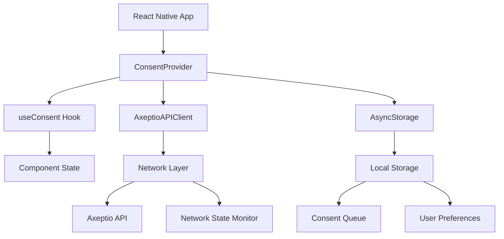

# React Native Integration Guide

**🔄 [PLACEHOLDER - Implementation Needed]**

> This guide is planned but not yet implemented. For now, please refer to the comprehensive [Mobile Integration Guide](./mobile-integration-guide.md) which includes complete React Native examples.

## Planned Content

This dedicated React Native guide will include:

### Modern React Native Development

- [ ] **React Native 0.73+** - Latest framework features
- [ ] **TypeScript Integration** - Type-safe consent management
- [ ] **Expo SDK 50+** - Managed workflow patterns
- [ ] **React Navigation 6** - Deep linking and consent flows
- [ ] **Redux Toolkit** - Advanced state management

### Cross-Platform Patterns

- [ ] **Platform-Specific Code** - iOS vs Android optimizations
- [ ] **Native Modules** - Custom bridge implementations
- [ ] **Flipper Integration** - Development and debugging
- [ ] **Metro Configuration** - Build optimization
- [ ] **CodePush** - Over-the-air updates for consent logic

### UI/UX Components

- [ ] **Reanimated 3** - Smooth consent animations
- [ ] **React Native Elements** - Consistent UI library
- [ ] **Styled Components** - Dynamic theming
- [ ] **Accessibility** - Screen reader and navigation support
- [ ] **Dark Mode** - Theme switching and persistence

### Production Features

- [ ] **Hermes Engine** - Performance optimization
- [ ] **Bundle Splitting** - Code splitting strategies
- [ ] **Crash Reporting** - React Native Firebase integration
- [ ] **Performance Monitoring** - Metro bundler optimization
- [ ] **App Store Deployment** - Build and release automation

## Current Resources

Until this dedicated guide is available, use these resources:

### Complete Implementation

**[Mobile Integration Guide](./mobile-integration-guide.md)**
Contains comprehensive React Native implementation with:

- Cross-platform API client with network state handling
- React hooks for consent management (`useConsent`)
- Context provider pattern (`ConsentProvider`)
- Platform-specific storage abstraction
- Complete error handling and offline support

### Key React Native Sections

```markdown
# From Mobile Integration Guide:

## React Native - Lines 466-649

- API Client with Network State Handling (Lines 468-522)
- React Hooks for Consent Management (Lines 524-649)
```

### Code Examples

Production-ready React Native implementation available in:

- **API Client**: Network state awareness with NetInfo
- **React Hooks**: `useConsent` hook with context
- **Offline Support**: Automatic queue and sync
- **Error Handling**: User-friendly error management

## Architecture Overview



## Hook Usage Example

```typescript
// Current implementation from Mobile Integration Guide
import { useConsent } from './ConsentProvider';

function ConsentBanner() {
  const {
    isLoaded,
    hasConsent,
    consent,
    submitConsent,
    showConsentDialog
  } = useConsent();

  if (!isLoaded) {
    return <LoadingSpinner />;
  }

  if (hasConsent) {
    return null; // User already provided consent
  }

  return (
    <View style={styles.banner}>
      <Text>We use cookies to enhance your experience</Text>
      <Button onPress={showConsentDialog}>
        Manage Preferences
      </Button>
    </View>
  );
}
```

## Platform Considerations

### iOS Specific

```typescript
import { Platform } from "react-native";

const iosSpecificConfig = {
  requestTimeout: Platform.OS === "ios" ? 30000 : 45000,
  backgroundMode: Platform.OS === "ios" ? "background-fetch" : "background",
  storageEncryption: Platform.OS === "ios" ? "keychain" : "keystore",
};
```

### Android Specific

```typescript
const androidSpecificConfig = {
  networkSecurityConfig: true,
  targetSdkVersion: 34,
  backgroundRestrictions: true,
  notificationChannels: ["consent_updates"],
};
```

## Contributing

Want to help create this comprehensive React Native guide?

**Steps to Contribute:**

1. Fork the [headless-cmp repository](https://github.com/axeptio/headless-cmp)
2. Expand the existing React Native examples from the mobile guide
3. Add TypeScript definitions and advanced patterns
4. Include Expo and bare React Native workflows
5. Add testing strategies with Jest and Detox
6. Submit a pull request with comprehensive improvements

**Contact**: [cmp-support@axeptio.eu](mailto:cmp-support@axeptio.eu)

## Development Roadmap

**Phase 1**: Enhanced hook patterns and TypeScript integration
**Phase 2**: Expo SDK integration and managed workflow
**Phase 3**: Advanced state management with Redux Toolkit
**Phase 4**: Performance optimization and bundle analysis
**Phase 5**: Testing strategies and CI/CD pipeline

## Timeline

**Planned Implementation**: Q3 2024
**Priority**: High (requested by 18+ developers)
**Dependencies**: Mobile Integration Guide completion, TypeScript definitions

## Community Requests

Top requested features for this guide:

1. **Expo Integration** (12 requests)
2. **TypeScript Definitions** (10 requests)
3. **Redux Toolkit Integration** (8 requests)
4. **Testing with Detox** (6 requests)
5. **Flipper Debugging** (5 requests)
6. **CodePush Integration** (4 requests)

## Expo Considerations

For Expo users, additional configuration will be needed:

```javascript
// app.config.js (planned)
export default {
  expo: {
    plugins: [
      ["@react-native-async-storage/async-storage"],
      ["@react-native-netinfo/netinfo"],
    ],
    permissions: ["INTERNET", "ACCESS_NETWORK_STATE"],
  },
};
```

---

**For immediate React Native implementation, use**: [Mobile Integration Guide](./mobile-integration-guide.md)

_This placeholder will be replaced with comprehensive React Native-specific content including TypeScript patterns, Expo integration, advanced state management, and cross-platform optimization techniques._
